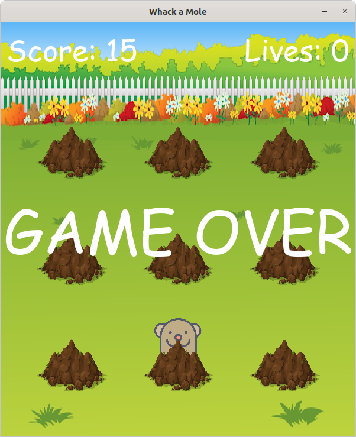

# Whack a Mole

The good old "Whack a Mole" game developed with `PyGame` and `Python`.

## Installation

1. Clone the repository
2. Install the required packages with `pip install -r requirements.txt`
3. Run the game with `python main.py`

## How to play

- Click on the moles to score points
- Avoid clicking on the bombs
- The game ends when you click on a bomb 3 times

## Screenshots

